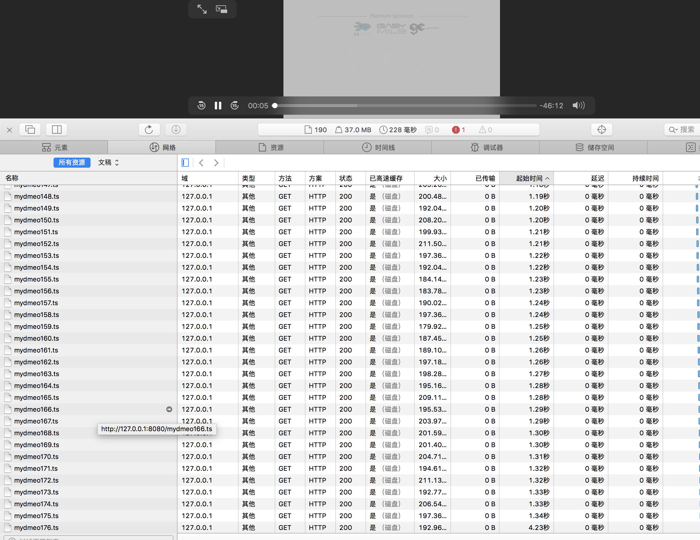
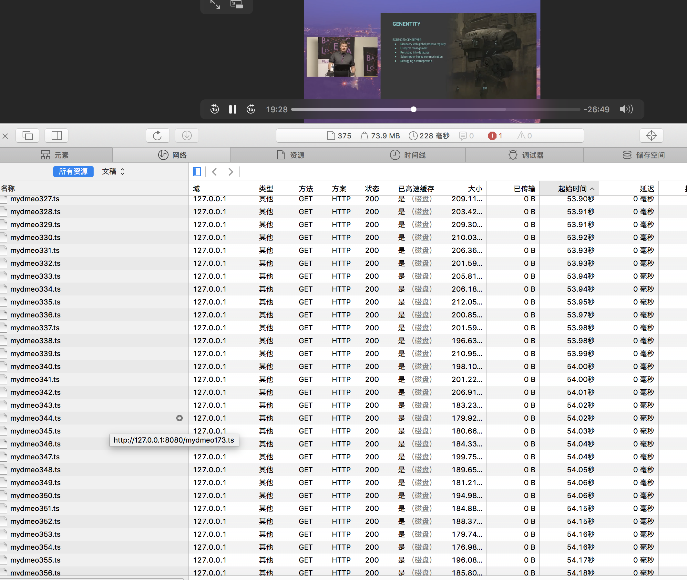

# ffmpeg m3u8 demo

## generate m3u8 segments file

* ts file generate

```bash
ffmpeg -y -i mydemo.mp4 -vcodec copy -acodec copy -vbsf h264_mp4toannexb appdemos/mydmeo.ts

```

* m3u8 file generate

```bash
ffmpeg -i appdemos/mydmeo.ts -c copy -map 0 -f segment -segment_list appdemos/mydmeo.m3u8 -segment_time 15 appdemos/mydmeo%03d.ts
```

* start local server to serve m3u8 files

```bash
cd appdemos
yarn run start
```

## some images



